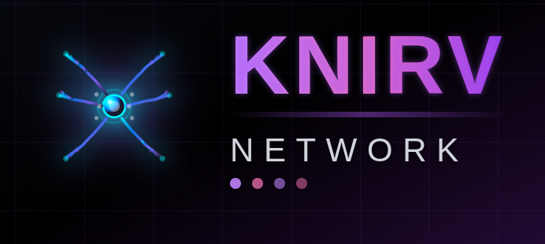

# KNIRVWALLET - Browser Bridge: A Decentralized Wallet for the KNIRV Ecosystem

[](#)

## Table of Contents

- [Overview](#overview)
- [Features](#features)
- [Project Environment](#project-environment)
- [Building Locally](#building-locally)
- [Documentation](#documentation)
- [KNIRV Ecosystem](#knirv-ecosystem)
- [Contributing](#contributing)
- [Support](#support)


## Overview

**KNIRVWALLET - Browser Bridge** is a powerful, open-source, non-custodial wallet providing seamless access to the KNIRV Decentralized Trusted Execution Network (D-TEN).  It allows users to manage NRN tokens, control KNIRV-CORTEX agents, and interact with the KNIRV ecosystem via an intuitive, Web2-like experience powered by XION's Meta Accounts.  For users, it simplifies managing decentralized AI and crypto; for developers, it offers comprehensive APIs for ecosystem and KNIRV-CORTEX agent integration.  KNIRVWALLET - Browser Bridge supports browser extensions, mobile apps, and progressive web apps, all unified under a single interface.


## Features

✅ **KNIRV Ecosystem Integration**
✅ **NRN Token Management:** Native support for KNIRV-ORACLE's NRN tokens
✅ **KNIRV-CORTEX Agent Control:** Manage and control your AI agents
✅ **XION Meta Accounts:** Gasless transactions and Web2-like authentication
✅ **Multi-Chain Support:** BTC, ETH, Solana, and more
✅ **Biometric Authentication:** Secure, convenient access
✅ **User Delegation Certificates (UDCs):** Secure agent authorization
✅ **Create & Restore Wallet**
✅ **View Account Balances**
✅ **Deposit & Send Tokens**
✅ **Transaction History**
✅ **Multi-Accounts**
✅ **Multi-Network**
✅ **Multi-Mnemonic**
✅ **Ledger Support**
✅ **Web3 Login Support**
✅ **Manage Custom Tokens**
✅ **Airgap Account Support**
⬜ **KNIRVANA Game Integration**
⬜ **Advanced Agent Analytics**
⬜ **Cross-Chain NRN Bridging**


## Project Environment

| Tool       | Version |
| ---------- | ------- |
| Node.js    | 18.14.2 |
| TypeScript | 4.9.5   |
| Babel Core | 7.23.9  |
| Webpack    | 5.90.3  |
| React      | 18.2.0  |


## Building Locally

To set up a local environment, clone this repository and run the following commands:

```bash
nvm use

yarn install

yarn build
```

This will store the extension's build output in `packages/knirvwallet-extension/dist`.


## Documentation

- [KNIRVWALLET_Whitepaper](../docs/whitepapers/KNIRVWALLET_Whitepaper.md)
- [XION Integration Guide](../agentic-wallet/XION_INTEGRATION.md)
- [Developer API Documentation](../docs/)


## KNIRV Ecosystem

KNIRVWALLET - Browser Bridge is part of the broader KNIRV ecosystem:

- [KNIRV-ORACLE](../KNIRVORACLE/) - The foundational blockchain for NRN tokens
- [KNIRVCHAIN](../KNIRVCHAIN/) - Smart contract platform for Skills and Base LLMs
- [KNIRV-CORTEX](../KNIRVCORTEX/) - AI agent framework
- [KNIRV-NEXUS](../KNIRVNEXUS/) - Distributed verification engine


## Contributing

Thank you for considering contributing to KNIRVWALLET - Browser Bridge! We value your input. Before submitting a pull request, please review these guidelines:

### How to Contribute

**Steps**

1. Check for existing issues or pull requests to avoid duplicates.
2. Fork the knirvwallet repository.
3. Create a new branch for your changes.
4. Make changes and commit them with concise, descriptive messages using the [Conventional Commits](https://www.conventionalcommits.org/) format. Ensure correct spelling, grammar, and remove trailing whitespace.
5. Push your branch to your forked repository.
6. Submit a pull request to our main branch.

**Pull Request Title**

Your pull request title must follow the conventional commits format and start with one of the following types:

- **feat**: A new feature (e.g., `feat: Add user authentication`)
- **chore**: Routine tasks or maintenance (e.g., `chore: Update dependencies`)
- **fix**: A bug fix (e.g., `fix: Resolve memory leak issue`)
- **test**: Adding missing tests or correcting existing tests (e.g., `test: Add unit tests for user registration`)
- **style**: Changes that do not affect code meaning (e.g., `style: Apply gofmt to the codebase`)
- **refactor**: Refactoring code without adding features or fixing bugs (e.g., `refactor: Optimize database query logic`)


## Support

If you have suggestions, want to contribute, or need support, please consider:

- Our [CONTRIBUTING.md](CONTRIBUTING.md) file for contribution guidelines.
- Opening an issue on our GitHub repository.
- Joining the KNIRV community.
